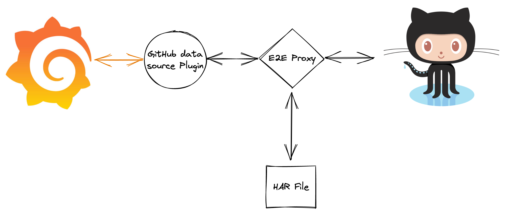
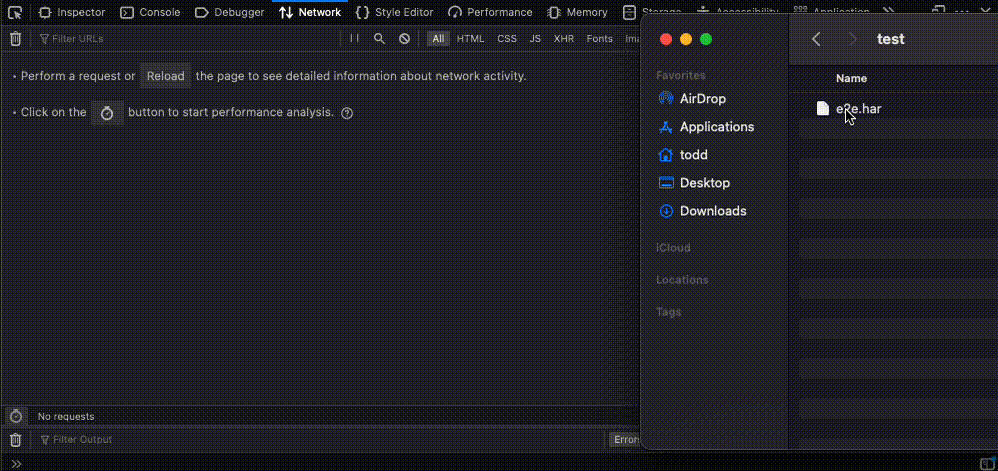

# E2E HTTP Fixture Proxy  <!-- omit in toc -->



The goal of the proxy is to provide a way to record and replay HTTP interactions between a data source backend and the target API. The use of recorded fixtures makes testing infrastructure simpler, and the stability of response data makes it easier to achieve deterministic tests.

- [Quick Setup](#quick-setup)
- [CA Certificate Setup](#ca-certificate-setup)
	- [Debian & Ubuntu](#debian--ubuntu)
	- [MacOS](#macos)
- [Config File](#config-file)
	- [address](#address)
	- [hosts](#hosts)
	- [storage](#storage)
- [Mage Commands](#mage-commands)
	- [Append mode](#append-mode)
	- [Overwrite mode](#overwrite-mode)
	- [Replay mode](#replay-mode)
	- [CA Certificate](#ca-certificate)
- [Reviewing Recorded Traffic](#reviewing-recorded-traffic)
- [Modifying Default Behavior](#modifying-default-behavior)

## Quick Setup

1. Create a `proxy.json` config file in the root of your plugin repo and replace `example.com` with the `host` or `host:port` of the API you wish to capture:

```json
{
	"storage": {
		"type": "har",
		"path": "fixtures/e2e.har"
	},
	"address": "127.0.0.1:9999",
	"hosts": ["example.com"]
}
```

2. Add the proxy's CA certificate to your environment ([instructions](#ca-certificate-setup)).

3. Start proxy using one of the [commands listed below](#mage-commands). For example:

```
mage e2e:append
```

4. Point Grafana at the proxy by exporting the `HTTP_PROXY` and `HTTPS_PROXY` environment variables:

```
export HTTP_PROXY=127.0.0.1:9999
export HTTPS_PROXY=127.0.0.1:9999
```

5. Start Grafana

**Note:** Only queries with **absolute time ranges** should be used with the proxy. Relative time ranges are not supported in the default matcher.

## CA Certificate Setup

This step is needed so that the proxy can intercept HTTPS traffic.

### Debian & Ubuntu

1. Add CA certificate:

```
mage e2e:certificate && sudo tee /usr/share/ca-certificates/extra/ca.crt
```

2. Update the CA store:

```
sudo update-ca-certificates --fresh
```

### MacOS

1. Create a temporary copy of the CA certificate:

```
mage e2e:certificate > /tmp/grafana-e2e.crt
```

2. Add CA certificate:

```
sudo security add-trusted-cert -d -p ssl -p basic -k /Library/Keychains/System.keychain /tmp/grafana-e2e.crt
```

## Config File

The E2E proxy can be configured by adding a `proxy.json` file to the root of your plugin's repo.

Default configuration:
```json
{
	"storage": {
		"type": "har",
		"path": "fixtures/e2e.har"
	},
	"address": "127.0.0.1:9999",
	"hosts": []
}
```

### address

The hostname or IP address and port for the proxy server.

Default: `127.0.0.1:9999`

### hosts

An allow list can be used to restrict captured traffic to a specific set of hosts.

Default: `[]` (traffic for all hosts will be captured)

### storage

An object used to define a type and configuration options for the fixture's storage.

Default: 
```json
{
	"type": "har",
	"path": "fixtures/e2e.har"
}
```

## Mage Commands

### Append mode

Append mode should be used to record interactions for any new tests. It will record requests and responses for any requests that haven't been seen before, and return recorded responses for any requests that match previously recorded interactions.

```
mage e2e:append
```

### Overwrite mode

Overwrite mode should be used if previously recorded interactions need to be replaced with new data.

```
mage e2e:overwrite
```

### Replay mode

Replay mode should be used in CI or locally if only playback of recorded data is needed. Replay mode will return recorded responses for any matching requests, and pass any requests that don't match recorded interactions to the target API.

```
mage e2e:replay
```

### CA Certificate

This command prints the CA certificate to stdout so that it can be added to the local test environment. For more information, see the [CA Setup](#ca-certificate-setup) section above.

```
mage e2e:certificate
```

## Reviewing Recorded Traffic

The default storage for recorded interactions are [HAR](https://en.wikipedia.org/wiki/HAR_(file_format)) files. Using the HAR format allows recorded interactions to be easily reviewed in tools like Postman or in browser dev tools.

To review the saved requests and responses, drag the HAR file into the network panel of your favorite browser.



## Modifying Default Behavior

You can modify the default request processor, response processor, and matching behavior in your plugin project by modifying the `Magefile.go` in the root of your project:

```go
//go:build mage
// +build mage

package main

import (
	// mage:import
	build "github.com/grafana/grafana-plugin-sdk-go/build"

	"bytes"
	"io/ioutil"
	"net/http"

	"github.com/grafana/grafana-plugin-sdk-go/experimental/e2e"
	"github.com/grafana/grafana-plugin-sdk-go/experimental/e2e/config"
	"github.com/grafana/grafana-plugin-sdk-go/experimental/e2e/fixture"
	"github.com/grafana/grafana-plugin-sdk-go/experimental/e2e/storage"
)

// Default configures the default target.
var Default = build.BuildAll

func CustomE2E() error {
	cfg, err := config.LoadConfig("proxy.json")
	if err != nil {
		return err
	}

	var store storage.Storage
	if cfg.Storage == nil || cfg.Storage.Type == config.StorageTypeHAR {
		har := storage.NewHARStorage(cfg.Storage.Path)
		if err := har.Load(); err != nil {
			har.Init()
		}
		store = har
	}
	fixture := fixture.NewFixture(store)

	// modify incoming requests
	fixture.WithRequestProcessor(func(req *http.Request) *http.Request {
		req.URL.Host = "example.com"
		req.URL.Path = "/hello/world"
		return req
	})

	// modify incoming responses
	fixture.WithResponseProcessor(func(res *http.Response) *http.Response {
		res.StatusCode = http.StatusNotFound
		res.Header = http.Header{}
		res.Body = ioutil.NopCloser(bytes.NewBufferString("Not found"))
		return res
	})

	// modify matching behavior
	fixture.WithMatcher(func(a, b *http.Request) bool {
		return true
	})

	proxy := e2e.NewProxy(e2e.ProxyModeAppend, fixture, cfg)
	return proxy.Start()
}
```

Start the proxy using the new `CustomE2E` mage target:

```
mage CustomE2E
```

In a separate terminal, use `curl` to test the new mage target:

```
curl --proxy 127.0.0.1:9999 -i http://example.com
HTTP/1.1 404 Not Found
Date: Mon, 21 Feb 2022 20:27:52 GMT
Content-Length: 9
Content-Type: text/plain; charset=utf-8

Not found
```

You should now see the following output in the proxy window:

```
mage CustomE2E
Starting proxy mode append addr 127.0.0.1:9999
Match url: http://example.com/hello/world status: 404
```

