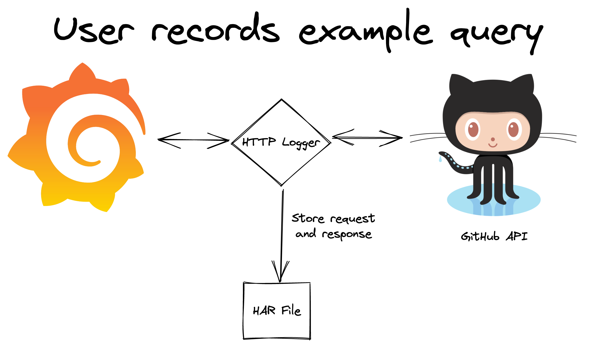
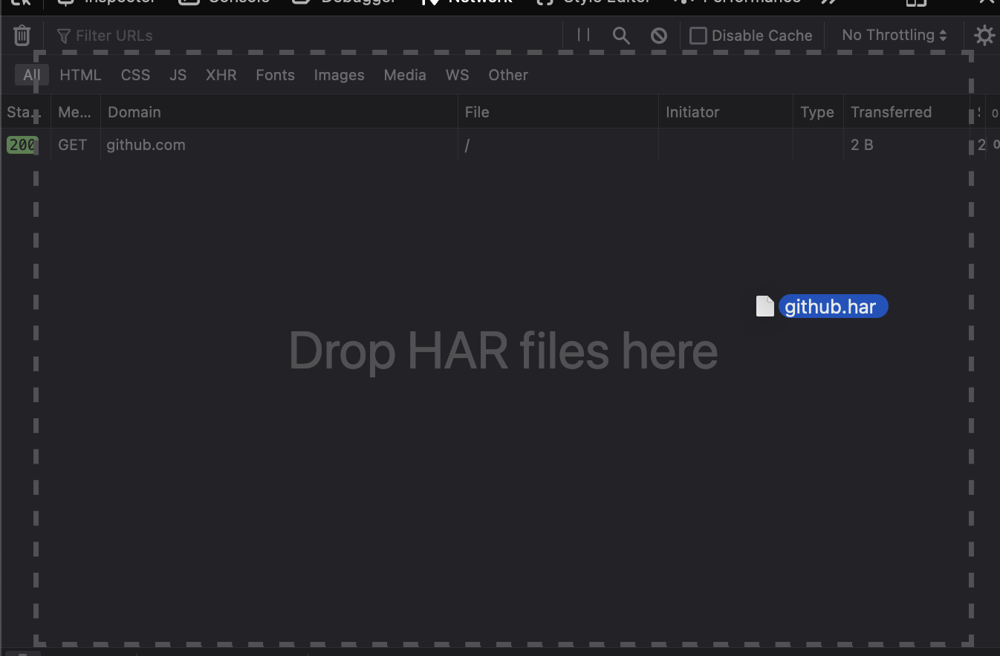
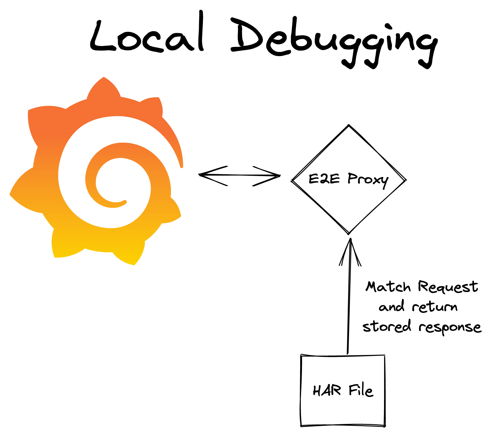

# HTTP Traffic Logger

This is intended to be used to record HTTP traffic between a backend data source plugin and
the target API for debugging purposes. For example, let's say a user is attempting to demonstrate a bug
with the GitHub data source plugin that is not reproducible with the developer's personal account. Currently,
it would be very difficult to determine the cause of the bug without having access to the user's GitHub	account. With the
HTTP logger, the workflow would look like this:

1. The user enables the	HTTP logger for the GitHub data source plugin in their `grafana.ini` configuration file.

```
[plugin.grafana-github-datasource]
har_log_enabled = true
har_log_path = /home/example/github.har
```

2. The user reproduces the bug in their environment.



3. The user reviews the [HAR file](https://en.wikipedia.org/wiki/HAR_(file_format)) generated by the HTTP logger in their browser's developer tools, and removes any sensitive information from the HAR file.



4. The user shares the HAR file with the developer, along with a dashboard JSON that contains the queries used to reproduce the bug.

4. The data source developer uses the E2E proxy in replay mode to replay the HTTP traffic recorded by the HTTP logger.



## Adding Support for HTTP Logging in a Data Source Plugin

`HTTPLogger` implements the `http.RoundTripper` interface, and wraps the existing `http.RoundTripper` implementation in
the data source plugin's HTTP client. For example, if the plugin's current HTTP client looks like this:

```go
client := &http.Client{
		Transport: &http.Transport{
			TLSClientConfig: &tls.Config{
				Renegotiation:      tls.RenegotiateFreelyAsClient,
				InsecureSkipVerify: settings.TLSSkipVerify,
			},
			Proxy: http.ProxyFromEnvironment,
			Dial: (&net.Dialer{
				Timeout:   30 * time.Second,
				KeepAlive: 30 * time.Second,
				DualStack: true,
			}).Dial,
			TLSHandshakeTimeout:   10 * time.Second,
			ExpectContinueTimeout: 1 * time.Second,
			MaxIdleConns:          100,
			IdleConnTimeout:       90 * time.Second,
		},
		Timeout: time.Second * 30,
		Transport: hl,
		Timeout:   time.Second * 30,
	},
}
```

Then, the `HTTPLogger` can be added by wrapping the existing `http.Transport` like this:

```go
transport := &http.Transport{
	TLSClientConfig: &tls.Config{
		Renegotiation:      tls.RenegotiateFreelyAsClient,
		InsecureSkipVerify: settings.TLSSkipVerify,
	},
	Proxy: http.ProxyFromEnvironment,
	Dial: (&net.Dialer{
		Timeout:   30 * time.Second,
		KeepAlive: 30 * time.Second,
		DualStack: true,
	}).Dial,
	TLSHandshakeTimeout:   10 * time.Second,
	ExpectContinueTimeout: 1 * time.Second,
	MaxIdleConns:          100,
	IdleConnTimeout:       90 * time.Second,
}
h := http_logger.NewHTTPLogger("grafana-github-datasource", transport)
client := &http.Client{
	Transport: h,
	Timeout:   time.Second * 30,
}
```

In the example above, `grafana-github-datasource` is the plugin ID, which can be found in the plugin's `src/plugin.json` file. This ID is used when enabling the HTTP logger in the user's `grafana.ini` configuration file.

```
[plugin.grafana-github-datasource]
har_log_enabled = true
har_log_path = /home/example/github.har
```

## Redacting Sensitive Information

By default, the HTTP logger will remove cookies and authorization headers from the HAR file, but the user should carefully
review the HAR file to ensure that any sensitive information is removed from responses before sharing it with the data source developer.

Since HAR files are actually JSON files, the user can edit the responses in a text editor. The user should verify that their browser is still able to load the HAR file after editing is complete.

## Local Debugging

Follow the E2E proxy's [Quick Setup](../e2e/README.md#quick-setup) instructions to configure the proxy to replay the recorded traffic.

Make sure specify the path to the HAR file that the user shared in the `proxy.json` file:

```json
{
	"storage": [{
		"type": "har",
		"path": "github.har"
	}],
	"address": "127.0.0.1:9999",
	"hosts": ["github.com"]
}
```

Start the proxy in replay mode to avoid overwriting the original HAR file shared by the user:

```
mage e2e:replay
```

It will be simpler to reproduce the issue if you request that the user saves a dashboard JSON with the query that caused the bug. The dashboard should be using an **absolute time range**. This will ensure that the query will match the traffic recorded in the HAR file when the dashboard is loaded by the developer.